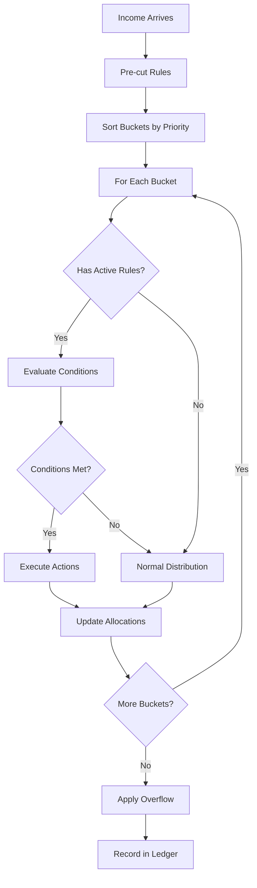

# Bucket Rules Engine - Architecture Specification

## Overview
The Rules Engine is the brain of the bucket system, enabling dynamic money flow based on conditions. It starts simple (MVP) and scales to complex financial logic over time.

## Design Principles
1. **Deterministic**: Same inputs always produce same outputs
2. **Transparent**: Every decision is explainable via allocation ledger
3. **Pure Functions**: No side effects, easy to test
4. **Progressive Complexity**: Simple rules first, advanced later

## Rule Phases

### Phase 1: Simple Gates (MVP)
Basic IF-THEN conditions for bucket routing:

```typescript
interface SimpleRule {
  id: string
  name: string
  condition: {
    bucket: string
    metric: 'balance' | 'progress' | 'full'
    operator: '<' | '>' | '=' | '<=' | '>='
    value: number
  }
  action: {
    type: 'redirect_percent' | 'redirect_amount'
    value: number
    target: string
  }
  priority: number
  active: boolean
}
```

Examples:
- "Until Emergency Fund reaches R30,000, redirect 30% here"
- "If Debt balance > 0, allocate extra R500"
- "When Vacation full, redirect to Investment"

### Phase 2: Complex Conditions
Multiple conditions with AND/OR logic:

```typescript
interface ComplexRule {
  id: string
  name: string
  conditions: {
    logic: 'AND' | 'OR'
    items: Condition[]
  }
  actions: Action[]
  priority: number
  active: boolean
}
```

Examples:
- "IF (Emergency < R30k AND month = December) THEN redirect 50%"
- "IF (All Debts = 0 OR Income > R100k) THEN increase Investment 10%"

### Phase 3: Smart Rules
Context-aware and learning rules:

```typescript
interface SmartRule {
  id: string
  name: string
  trigger: {
    event: 'income' | 'expense' | 'time' | 'balance_change'
    conditions: Condition[]
  }
  actions: Action[]
  learning: {
    track: string[]
    adjust: boolean
  }
}
```

## Rule Types

### 1. Pre-cut Rules
Execute before any bucket distribution:
- **Pay-Yourself-First**: Take 5% immediately
- **Tax Provision**: Set aside tax percentage
- **Fixed Obligations**: Ensure minimums are met

### 2. Distribution Rules
Control how money flows between buckets:
- **Gates**: Conditional redirects
- **Caps**: Stop filling at target
- **Cascades**: Overflow to next bucket

### 3. Protection Rules
Prevent dangerous financial moves:
- **Minimum Balance**: Keep reserves above threshold
- **Withdrawal Blocks**: Prevent accessing locked funds
- **Overspend Alerts**: Warn when exceeding limits

### 4. Automation Rules
Handle routine decisions:
- **Debt Snowball**: Cascade payments
- **Sweep Rules**: Month-end cleanup
- **Rebalancing**: Maintain ratios

## Rule Execution Order



## Rule Templates (MVP)

### Emergency Fund Builder
```json
{
  "name": "Build Emergency Fund",
  "condition": {
    "bucket": "emergency-fund",
    "metric": "balance",
    "operator": "<",
    "value": 30000
  },
  "action": {
    "type": "redirect_percent",
    "value": 30,
    "target": "emergency-fund"
  }
}
```

### Debt Avalanche
```json
{
  "name": "Pay High Interest First",
  "condition": {
    "bucket": "credit-card",
    "metric": "balance",
    "operator": ">",
    "value": 0
  },
  "action": {
    "type": "redirect_amount",
    "value": 1000,
    "target": "credit-card"
  }
}
```

### Play Budget Enforcement
```json
{
  "name": "Must Spend Play Money",
  "condition": {
    "bucket": "play",
    "metric": "balance",
    "operator": ">",
    "value": 0,
    "date": "month-end"
  },
  "action": {
    "type": "alert",
    "message": "Use your play budget or lose it!"
  }
}
```

## Implementation Architecture

### Core Components

```typescript
// Rule Evaluator
class RuleEvaluator {
  evaluate(rule: Rule, context: BucketContext): boolean
  
  private evaluateCondition(condition: Condition, context: BucketContext): boolean
  private compareValues(left: number, operator: string, right: number): boolean
}

// Action Executor
class ActionExecutor {
  execute(action: Action, context: BucketContext): AllocationResult
  
  private redirect(amount: number, source: string, target: string): void
  private alert(message: string, severity: AlertLevel): void
}

// Allocation Engine
class AllocationEngine {
  allocate(income: number, buckets: Bucket[], rules: Rule[]): AllocationLedger
  
  private applyPrecuts(income: number): number
  private distributeByPriority(amount: number, buckets: Bucket[]): void
  private processRules(bucket: Bucket, amount: number): number
  private handleOverflow(bucket: Bucket, excess: number): void
}
```

### Data Flow
1. Income enters system
2. Pre-cut rules execute first
3. Buckets sorted by priority
4. For each bucket:
   - Check applicable rules
   - Calculate distribution
   - Apply caps/limits
   - Handle overflow
5. Record all decisions in ledger

## Allocation Ledger

Every allocation decision is recorded for transparency:

```typescript
interface AllocationRecord {
  timestamp: Date
  source: 'income' | 'rule' | 'overflow' | 'manual'
  amount: number
  fromBucket?: string
  toBucket: string
  rule?: {
    id: string
    name: string
    condition: string
  }
  calculation: {
    steps: string[]
    formula: string
    result: number
  }
}
```

Example ledger entry:
```json
{
  "timestamp": "2024-12-20T08:00:00Z",
  "source": "rule",
  "amount": 742.15,
  "fromBucket": "reserves-parent",
  "toBucket": "emergency-fund",
  "rule": {
    "id": "emergency-builder",
    "name": "Build Emergency Fund",
    "condition": "emergency-fund.balance < 30000"
  },
  "calculation": {
    "steps": [
      "Income after tax: R7,250",
      "Income after LTF: R6,887.50",
      "Reserves allocation (30%): R2,066.25",
      "Emergency redirect (30% of reserves): R619.88",
      "Rounding adjustment: R0.12"
    ],
    "result": 620.00
  }
}
```

## Performance Considerations

### Optimization Strategies
1. **Rule Caching**: Cache evaluated conditions
2. **Batch Processing**: Evaluate all rules in single pass
3. **Lazy Evaluation**: Only compute when needed
4. **Memoization**: Store repeated calculations

### Benchmarks
- Target: Process 100 buckets with 50 rules in <100ms
- Memory: Keep allocation history for 12 months
- UI: Update projections in real-time (<16ms)

## Testing Strategy

### Unit Tests
- Rule condition evaluation
- Action execution
- Priority ordering
- Overflow handling

### Integration Tests
- Full allocation flows
- Rule conflicts
- Edge cases (circular rules, impossible conditions)

### Property-Based Tests
- Money conservation (no cents lost)
- Deterministic outcomes
- Rule precedence

## Future Enhancements

### Machine Learning
- Pattern detection in spending
- Rule suggestions based on behavior
- Anomaly detection
- Optimization recommendations

### Natural Language Rules
- "Save aggressively until emergency fund is full"
- "Pay off highest interest debt first"
- "Increase savings by 1% each month"

### External Integrations
- Market conditions ("IF stock_market = 'bear' THEN increase cash reserves")
- Calendar events ("IF month = 'December' THEN double gift budget")
- Goal deadlines ("IF days_to_vacation < 60 THEN maximize vacation fund")